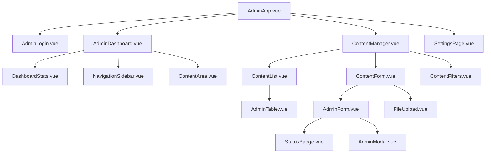

# Admin Panel Dashboard Design Specification

## Overview
This document outlines the design for the admin panel dashboard for the BIM CMS content management system. The admin panel will provide authenticated administrators with tools to manage all content types, view statistics, and handle contact submissions.

## Current System Analysis

### Frontend Architecture
- **Framework**: Vue.js 3 with Composition API
- **Routing**: Custom pathname-based routing (no Vue Router)
- **Styling**: RTL layout, Vazirmatn font, teal (#1abc9c) accents, neutral backgrounds
- **Components**: Card-based layouts, hover effects, smooth animations
- **Responsiveness**: Mobile-first design with breakpoints

### Backend APIs
- **Authentication**: JWT-based with login/register endpoints
- **Content Types**: Articles, Projects, Services, Team Members, Certificates, Licenses
- **Admin Endpoints**: CRUD operations for all content, contact submission management
- **File Uploads**: Supported via multipart/form-data

## Design Requirements

### Core Features
1. Admin authentication with login page
2. Dashboard with summary statistics
3. Navigation sidebar for content management
4. CRUD interfaces for all content types
5. Contact submission management with status tracking
6. Settings page for company info and statistics
7. File upload handling
8. Responsive design matching frontend patterns

## Component Structure

### Page-Level Components
```
AdminApp.vue (main admin container)
├── AdminLogin.vue (login page)
├── AdminDashboard.vue (main dashboard)
│   ├── DashboardStats.vue (summary cards)
│   ├── NavigationSidebar.vue (menu)
│   └── ContentArea.vue (dynamic content)
├── ContentManager.vue (generic list/edit container)
│   ├── ContentList.vue (table/grid view)
│   ├── ContentForm.vue (add/edit form)
│   └── ContentFilters.vue (search/filter controls)
└── SettingsPage.vue (company info/stats)
```

### Shared Components
```
AdminCard.vue (card wrapper with admin styling)
AdminTable.vue (data table with actions)
AdminForm.vue (form wrapper with validation)
AdminModal.vue (modal dialogs)
FileUpload.vue (image upload component)
StatusBadge.vue (status indicators)
```

## Routing Structure

### URL Patterns
```
/admin/login - Login page
/admin - Dashboard overview
/admin/articles - Article management
/admin/projects - Project management
/admin/services - Service management
/admin/team - Team member management
/admin/certificates - Certificate management
/admin/licenses - License management
/admin/contacts - Contact submissions
/admin/settings - Company settings
```

### Route Handling
Extend current `handleRouting()` in App.vue to support admin routes with authentication checks.

## Authentication Flow

### Login Process
1. Admin enters credentials on `/admin/login`
2. API call to `/auth/login` returns JWT token
3. Token stored in localStorage
4. Axios interceptor adds Authorization header to all requests
5. Redirect to `/admin` dashboard

### Session Management
- Check for valid token on admin route access
- Auto-redirect to login if token missing/expired
- Logout clears token and redirects to home

## Dashboard Overview

### Statistics Cards
- Total Articles (published/draft counts)
- Total Projects
- Total Contact Submissions (by status: new/read/replied)
- Total Team Members
- Recent Activity Feed

### Layout
- Sidebar navigation (fixed left)
- Main content area (responsive grid)
- Cards with hover animations matching frontend style

## Content Management Interface

### Generic Structure
Each content type uses the same component structure with type-specific configurations:

#### List View
- Table display with columns for key fields
- Pagination controls
- Search and filter options
- Action buttons (edit, delete, view)
- Bulk actions where applicable

#### Add/Edit Form
- Bilingual fields (Persian/English where applicable)
- File upload for images
- Rich text editor for content fields
- Validation with error messages
- Save/Cancel actions

### Content Type Specifics

#### Articles
- Fields: title_fa/title_en, content_fa/content_en, slug, tags, category, publish_date, is_published
- Image upload for featured image
- Slug auto-generation from title

#### Projects
- Fields: title_fa/title_en, description_fa/description_en, category, completion_date, images
- Multiple image uploads
- Gallery management

#### Services
- Fields: title_fa/title_en, description_fa/description_en, icon, category
- Icon selection/upload

#### Team Members
- Fields: name_fa/name_en, position_fa/position_en, bio_fa/bio_en, image
- Profile photo upload

#### Certificates
- Fields: title_fa/title_en, issuer, issue_date, expiry_date, certificate_file
- PDF/document upload

#### Licenses
- Fields: title_fa/title_en, issuer, license_number, issue_date, expiry_date, license_file
- PDF/document upload

#### Contact Submissions
- List with status badges (new/read/replied)
- Detail view with full message
- Status update actions
- Reply functionality (future)

## Settings Page

### Company Info
- Bilingual fields for company details
- Contact information
- Social media links
- Logo upload

### Statistics
- Editable counters for dashboard display
- Projects completed, service types, employees, satisfied clients

## Technical Implementation

### State Management
- Vue Composition API for component state
- Global admin store for authentication state
- Local component state for forms and lists

### API Integration
Extend `src/services/api.js` with admin services:
```javascript
export const adminAuthService = {
  login: (credentials) => api.post('/auth/login', credentials),
  getCurrentUser: () => api.get('/auth/me')
}

export const adminArticleService = {
  getAll: (params) => api.get('/admin/articles', { params }),
  create: (data) => api.post('/admin/articles', data),
  update: (id, data) => api.put(`/admin/articles/${id}`, data),
  delete: (id) => api.delete(`/admin/articles/${id}`)
}
// Similar for other content types

export const adminContactService = {
  getAll: (params) => api.get('/admin/contact-submissions', { params }),
  updateStatus: (id, status) => api.patch(`/admin/contact-submissions/${id}/status`, { status })
}
```

### File Upload Handling
- Multipart form data for image uploads
- Preview functionality
- Drag-and-drop support
- File type and size validation

### Validation & Error Handling
- Client-side validation using Vuelidate or similar
- API error response handling
- User-friendly error messages
- Loading states for all async operations

### Responsive Design
- Match existing breakpoints: 480px, 768px, 1024px
- Mobile-first approach
- Sidebar collapses to hamburger menu on mobile
- Tables become card layouts on small screens

## Security Considerations
- All admin routes require authentication
- JWT token validation on each request
- CSRF protection for forms
- Input sanitization
- File upload security (type checking, size limits)

## Integration Points

### Backend Requirements
- Ensure admin-only endpoints exist for all content types (may need to add /admin/articles etc.)
- File upload endpoints for images/documents
- Proper CORS configuration for admin routes

### Frontend Integration
- Update App.vue to include admin pages
- Add admin-specific styles maintaining design consistency
- Implement authentication guards for admin routes

## Implementation Phases

1. **Phase 1**: Authentication system and basic dashboard
2. **Phase 2**: Article management interface
3. **Phase 3**: Project and service management
4. **Phase 4**: Team, certificates, licenses management
5. **Phase 5**: Contact submissions and settings
6. **Phase 6**: Polish, testing, and optimization

## Mermaid Diagram: Component Hierarchy



This design maintains consistency with the existing frontend while providing comprehensive admin functionality.